## `data-viz-catalog`: Repo for sharing data viz snippets generated by Loft Data Science team
This repository intends to share with the Data Science community and data viz enthusiasts the charts and visualizations generated by Loft Data Science Team which appear in our posts and projects. Data viz is an art, from picking the appropriate chart, to choosing expressive and harmonic aesthetic elements - we try to contribute with some inspirations, making the code open.

The catolog is organized by chart function.

For now, all the charts are generated using Python packages such as matplotlib, seaborn, folium, wordcloud and other interesting resources. 

If you spot any improvement possibility, feel free to open an issue. 

### Distribution
1. Histogram of ages: code at [src/age_hist.py](https://github.com/loft-br/data-viz-catalog/blob/main/src/age_hist.py)

  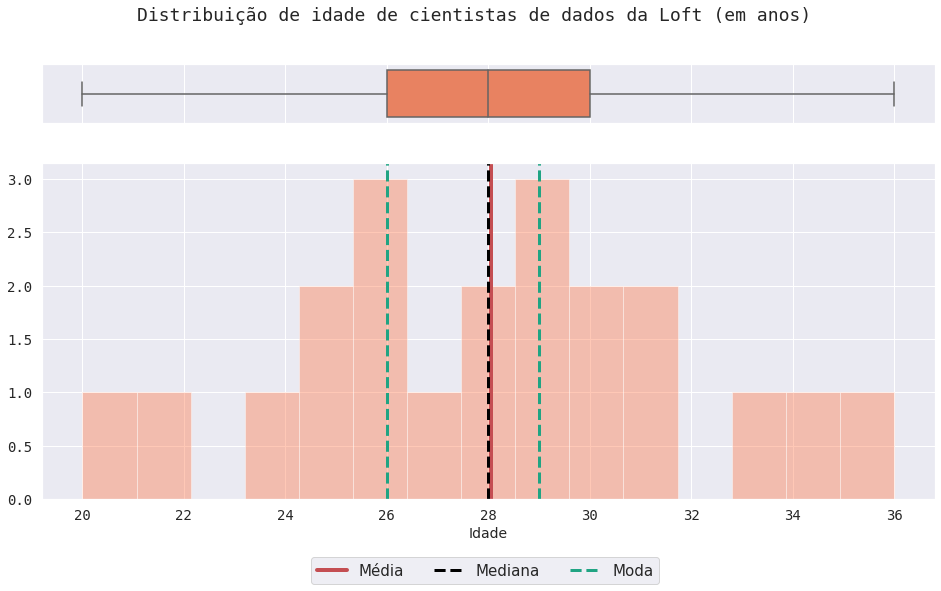

### Part of a Whole
1. Venn diagram of study areas: code at [src/area_venn.py](https://github.com/loft-br/data-viz-catalog/blob/main/src/area_venn.py)

  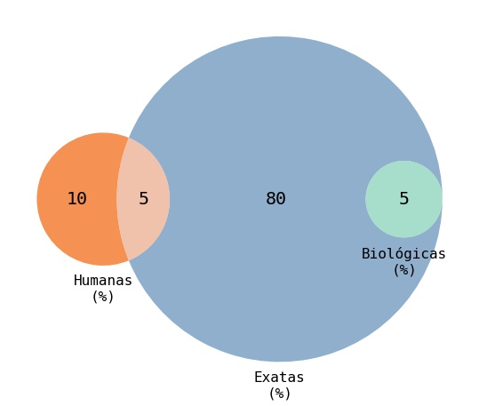

2. Unweighted Venn diagram of study areas: code at [src/area_venn_unw.py](https://github.com/loft-br/data-viz-catalog/blob/main/src/area_venn_unw.py)

  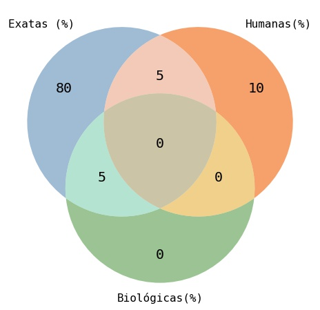

3. Horizontal stacked bar of beverage preferences: code at [src/bebidas_barh.py](https://github.com/loft-br/data-viz-catalog/blob/main/src/bebidas_barh.py)

  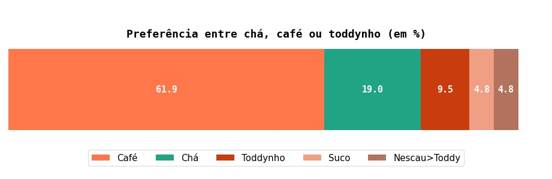

4. Pie chart gif of "biscoito" vs "bolacha": code at [src/biscoito_bolacha_pie.py](https://github.com/loft-br/data-viz-catalog/blob/main/src/biscoito_bolacha_pie.py)

  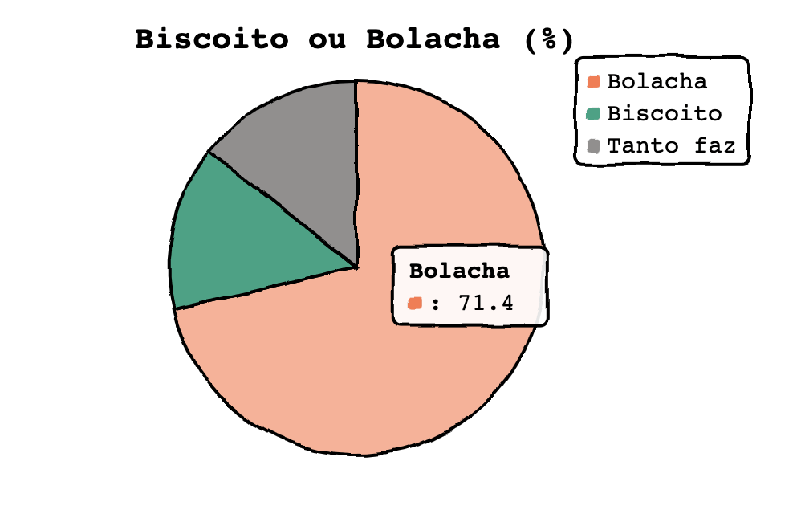

5. Horizontal stacked bar gif of capital vs coutryside origin: code at [src/capital_interior_bar.py](https://github.com/loft-br/data-viz-catalog/blob/main/src/capital_interior_bar.py)

  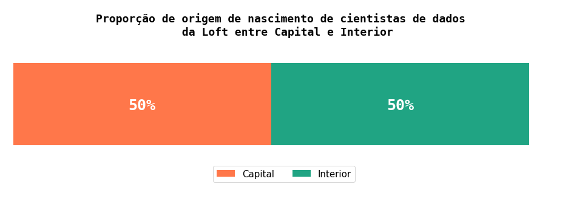

6. Circular packing chart of preferences related to eating "coxinha": code at [src/coxinha_circ_pack.py](https://github.com/loft-br/data-viz-catalog/blob/main/src/coxinha_circ_pack.py)

  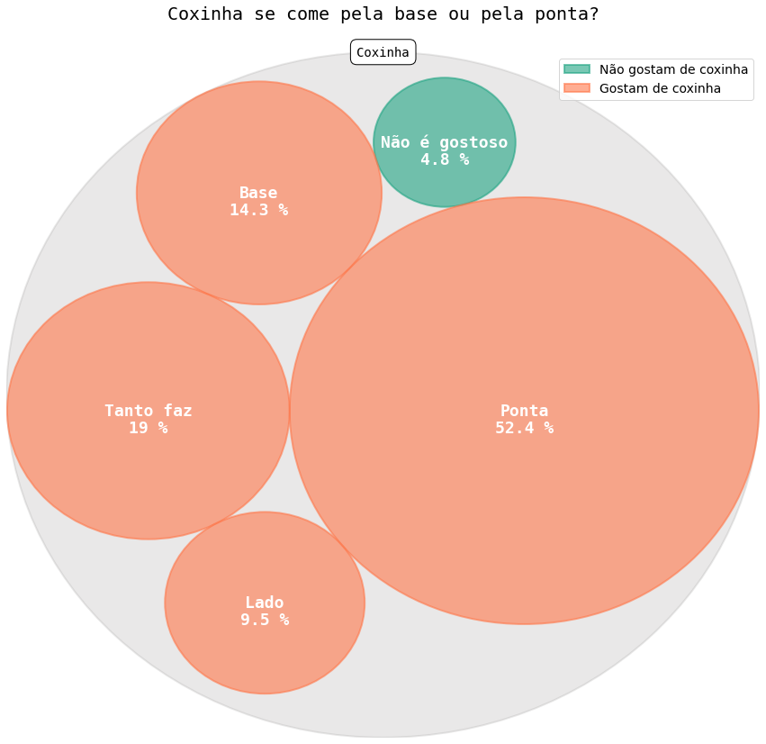

7. Diversity bar plots: code at [src/diversity_bar.py](https://github.com/loft-br/data-viz-catalog/blob/main/src/diversity_bar.py)

  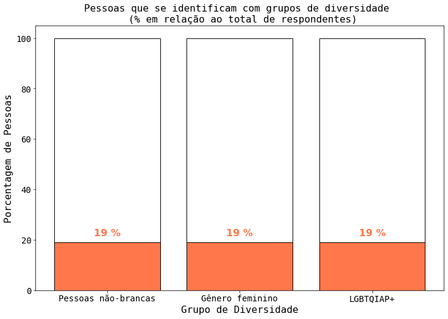

8. Education waffle chart: code at [src/education_waffle.py](https://github.com/loft-br/data-viz-catalog/blob/main/src/education_waffle.py)

  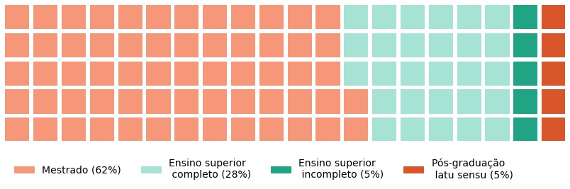

9. Experience waffle chart: code at [src/experience_waffle.py](https://github.com/loft-br/data-viz-catalog/blob/main/src/experience_waffle.py)

  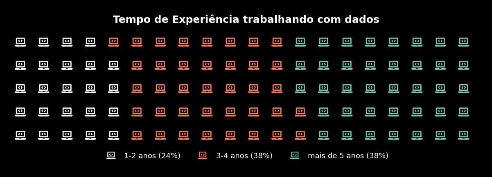

10. Preferred programming waffle chart: code at [src/programming_waffle.py](https://github.com/loft-br/data-viz-catalog/blob/main/src/programming_waffle.py)

  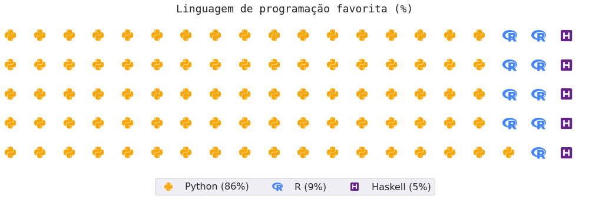

11. Soda treemap: code at [src/refri_treemap.py](https://github.com/loft-br/data-viz-catalog/blob/main/src/refri_treemap.py)

  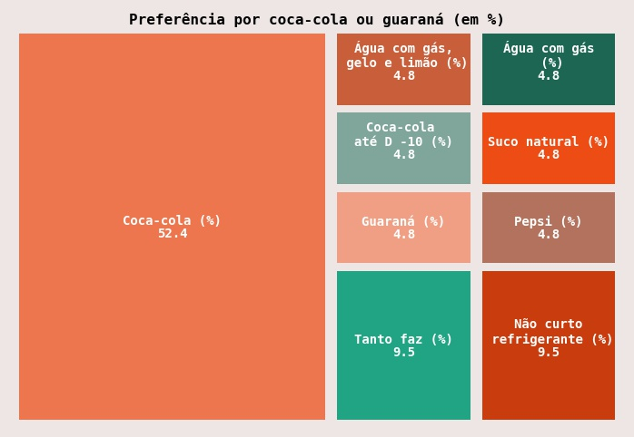

12. Working at Loft waffle chart: code at [src/trabalho_loft_waffle.py](https://github.com/loft-br/data-viz-catalog/blob/main/src/trabalho_loft_waffle.py)

  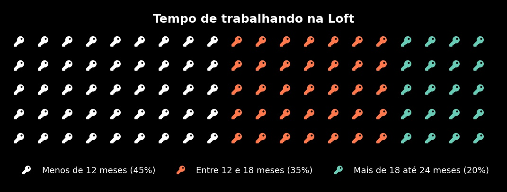

13. Preferred work mode Venn diagram: code at [src/work_venn.py](https://github.com/loft-br/data-viz-catalog/blob/main/src/work_venn.py)

  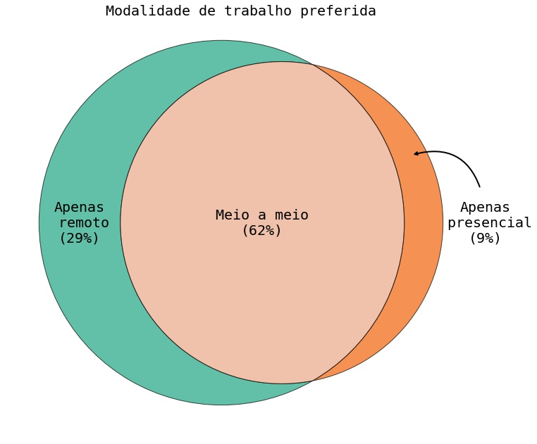

### Ranking
1. Wordcloud of development and studies sources: code at [src/estudos_wordcloud.py](https://github.com/loft-br/data-viz-catalog/blob/main/src/estudos_wordcloud.py)

  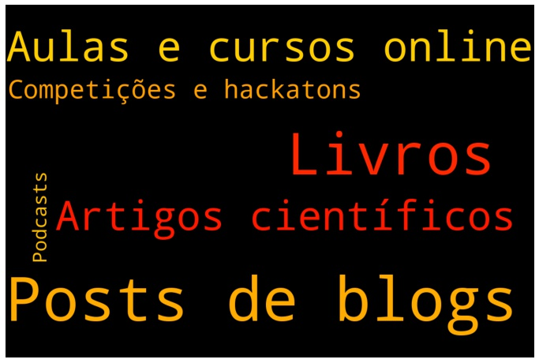

2. Wordcloud of hobbies by nature: code at [src/hobbies_wordcloud.py](https://github.com/loft-br/data-viz-catalog/blob/main/src/hobbies_wordcloud.py)

  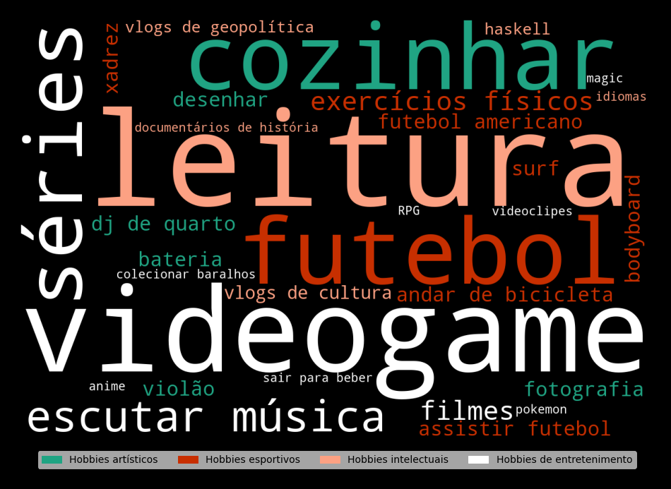

3. Lollipop chart of work experience per industries: code at [src/industria_lollipop.py](https://github.com/loft-br/data-viz-catalog/blob/main/src/industria_lollipop.py)

  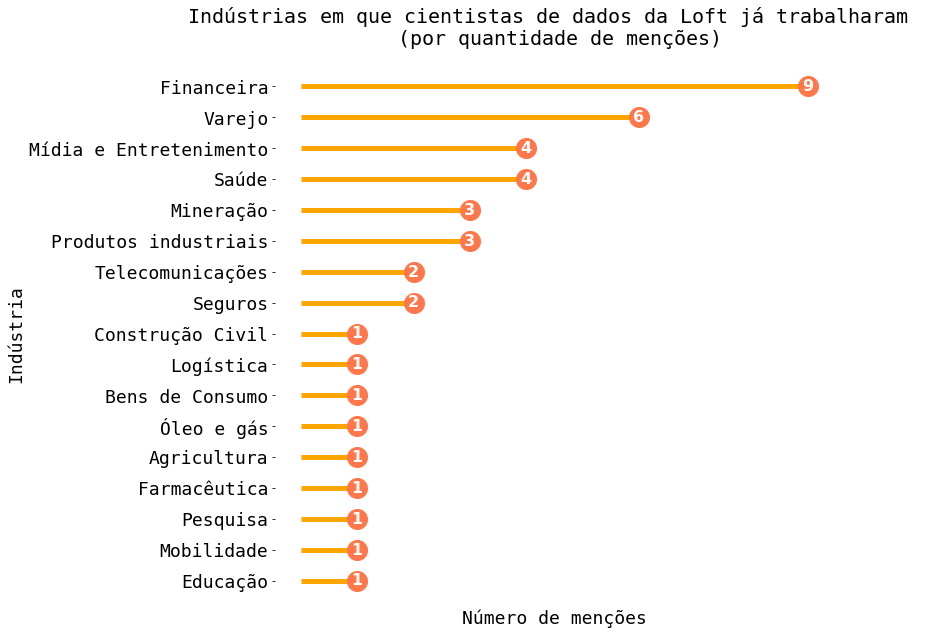

4. Masked books wordcloud: code at [src/livro_wordcloud.py](https://github.com/loft-br/data-viz-catalog/blob/main/src/livro_wordcloud.py)

  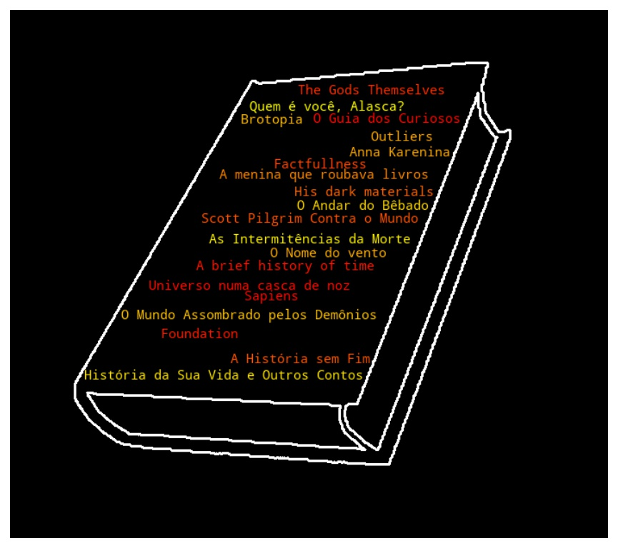

5. Podium of most studied subjects using bar chart: code at [src/most_studied_subjects_bar.py](https://github.com/loft-br/data-viz-catalog/blob/main/src/most_studied_subjects_bar.py)

  

6. Radar chart of favourite music styles: code at [src/musica_radar.py](https://github.com/loft-br/data-viz-catalog/blob/main/src/musica_radar.py)

  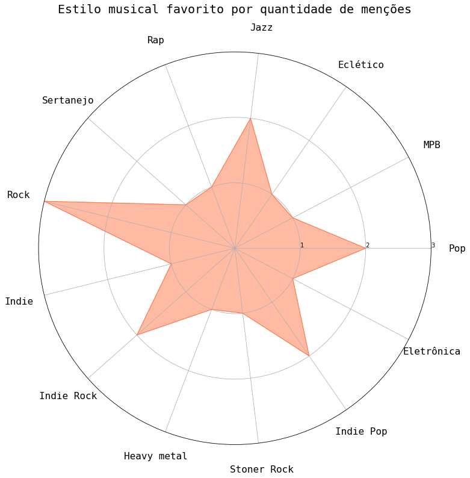

7. Circular packing chart of virtual meeting delay excuses: code at [src/zoom_circ_pack.py](https://github.com/loft-br/data-viz-catalog/blob/main/src/zoom_circ_pack.py)

  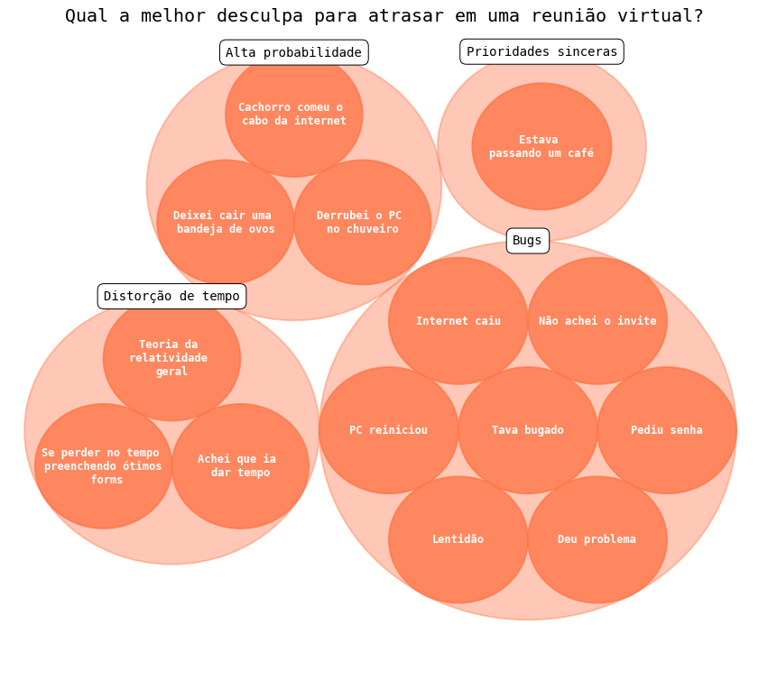

### Map
1. Map of birth place: code at [src/origin_map.py](https://github.com/loft-br/data-viz-catalog/blob/main/src/origin_map.py)

  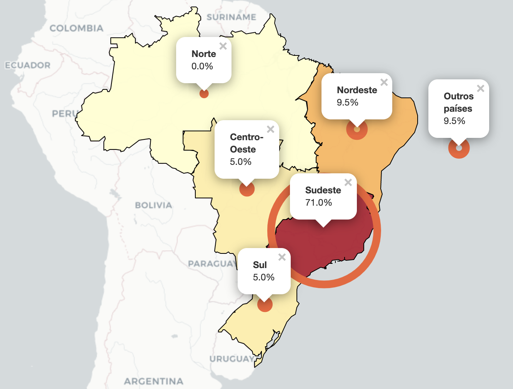

### References

[1] [Python Graph Gallery](https://www.python-graph-gallery.com/): collection of charts and graphs made in Python.

[2] [Data Viz Project](https://datavizproject.com/#): website presenting data visualization tool box by ferdio.

[3] [PyWaffle](https://github.com/gyli/PyWaffle): open-source Python package for plotting waffle charts

[4] [Basic of GIFs with Python Matplotlib](https://towardsdatascience.com/basics-of-gifs-with-pythons-matplotlib-54dd544b6f30): guide to creating GIFs based on multiple charts using Python matplotlib and imageio.

[5] [Cutecharts](https://github.com/cutecharts/cutecharts.py): open-source Python package inspired by chart.xkcd, a visualization package written in Javascript.

[6] [WordCloud](https://github.com/amueller/word_cloud): Word cloud generator package in Python.

[7] [DATACIDES](https://github.com/marcosacj/datacides): a study about Homicides and Femicides in Brazil, involving data visualization with Folium.
